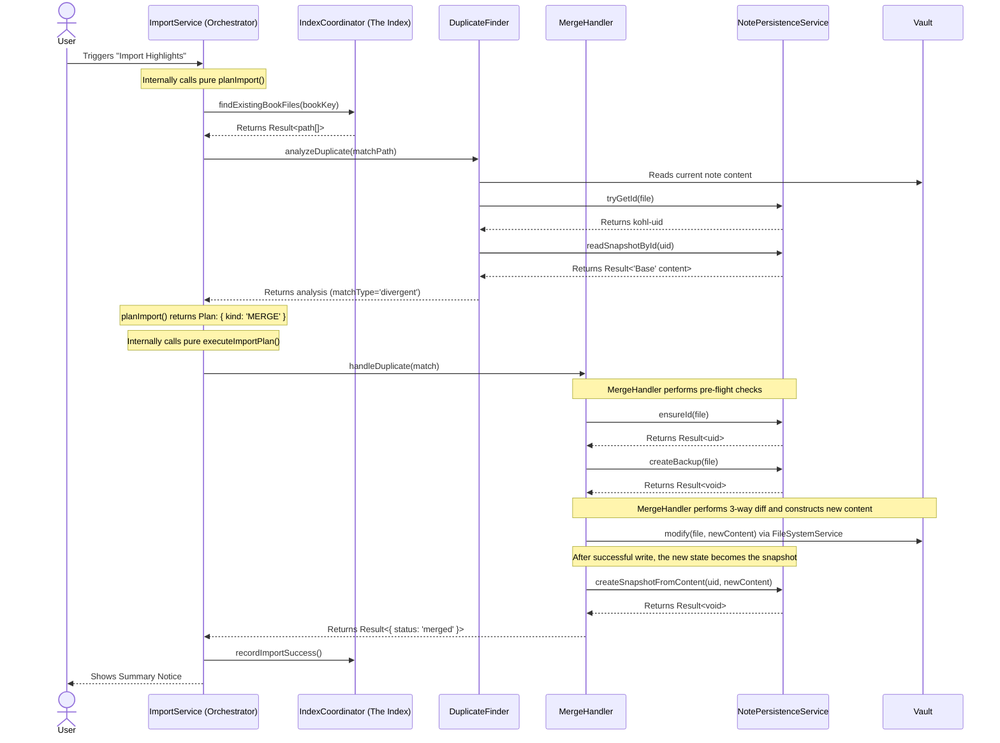

### **Architecture Document (v1.4.0)**

### **1. Mission & Guiding Principles**

The primary mission of the KOReader Highlights Importer plugin is to provide a powerful and, above all, **safe** tool for synchronizing reading highlights into Obsidian. The architecture has evolved significantly from a simple script to a robust, resilient system in direct response to the complexities of data synchronization and invaluable user feedback.

Every architectural decision is weighed against these non-negotiable principles:

1.  **Data Integrity is Paramount:** The plugin must **never** silently lose or corrupt user data. This principle is the primary driver for the existence of our UID system, atomic snapshotting, and 3-way merge logic. We prefer to surface a clear conflict to the user rather than make an incorrect assumption.
2.  **Graceful Degradation & Resilience:** The plugin must function effectively even in restrictive environments (e.g., sandboxed vaults, read-only file systems). When an I/O operation fails, the system must handle the error gracefully, inform the user, and remain functional. This favors a reactive error-handling model over complex, proactive capability checks.
3.  **Performance at Scale:** The user experience for those with large libraries is a primary concern. Operations must be fast and responsive. This justifies the overhead of a dedicated SQLite index, parallel processing, and extensive caching.
4.  **Clarity Over Cleverness:** The architecture is designed for maintainability. Each component has a clear, single responsibility. We favor established patterns and explicit logic over "magical" solutions to ensure the codebase is approachable for new contributors.
5.  **Champion Simplicity:** We actively seek to reduce complexity and line count. Abstractions must justify their existence. Code that is easy to **delete** is valued.

### **2. Architectural Paradigm: Stateful Shell, Functional Core**

To achieve our principles, the plugin is architected around the **"Stateful Shell, Functional Core"** paradigm. This creates a strong separation between the parts of the code that interact with the "outside world" and the pure, predictable business logic.

*   **The Stateful Shell:** This is the outer layer of the plugin. It is responsible for all side effects and interactions with external systems.
    *   **Responsibilities:** Handling user commands (`CommandManager`), rendering UI (Modals, Settings Tab), all file I/O (`FileSystemService`), all Obsidian API calls (`app.vault`, `app.metadataCache`), interacting with external devices (`DeviceService`), and logging.
    *   **Examples:** `ImportService`, `CommandManager`, `FileSystemService`, `MergeHandler`, `NotePersistenceService`.

*   **The Functional Core:** This is the inner layer, composed of pure, testable functions and data structures. These components take data in and return data out, with no side effects.
    *   **Responsibilities:** Parsing Lua data (`lib/parsing/luaParser.ts`), transforming annotations into Markdown (`lib/template/templateCore.ts`), generating and merging frontmatter data structures (`lib/frontmatter/frontmatterCore.ts`), validating data, and performing diffs (`lib/merge/mergeCore.ts`).
    *   **Example:** A function in the core might take raw annotation data and return a rendered Markdown string, but it will *never* write that string to a file or show a `Notice` itself. That is the Shell's job.

This separation is critical for testability, predictability, and long-term maintainability.

### **3. Code Structure Overview**

The `src` directory is organized to reflect the architectural paradigm and separation of concerns.

*   `main.ts`: The plugin entry point. Responsible for initializing the DI container and wiring up the top-level services and UI components.
*   `core/`: The plugin's engine room. Contains the Dependency Injection (DI) container, settings schema validation (`settingsSchema.ts`), data persistence (`PluginDataStore.ts`), and service registration logic.
*   `services/`: The heart of the application logic, strictly organized by domain. This layer acts as the **Stateful Shell**.
    *   `services/vault/`: Services that interact directly with the Obsidian vault. This includes the `IndexCoordinator` for managing the book index and the cohesive `NotePersistenceService`, which handles a note's identity (`kohl-uid`) and its historical snapshots for merging.
    *   `services/import/`: Home of the primary `ImportService` facade, which orchestrates the end-to-end import process.
    *   `services/device/`: A single, unified service for validating and interacting with the user-configured KOReader device filesystem and statistics database.
    *   `services/parsing/`: **Hybrid Services.** These services orchestrate pure logic from `lib/` with stateful operations like file reads. For example, `TemplateManager` uses `FileSystemService` to load templates from the vault but relies on `lib/template/templateCore.ts` for the pure compilation logic.
*   `lib/`: **The Functional Core's Toolbox.** Contains framework-agnostic, pure utilities. Code in `lib` **must not** depend on any module from `services/`, `ui/`, or the `obsidian` package itself. This is a strict architectural boundary.
    *   `lib/frontmatter/`: Pure logic for generating, merging, and parsing frontmatter.
    *   `lib/merge/`: Pure 3-way merge and conflict formatting logic.
    *   `lib/pathing.ts`: A canonical module for path normalization, filesystem-safe slug generation, and filename templating.
    *   `lib/strings/`: Pure, general-purpose string manipulation utilities.
    *   `lib/concurrency/`, `lib/cache/`, `lib/errors/`: Cross-cutting, pure utility modules.
*   `ui/`: All Obsidian-specific UI components, including the settings tab, modals, and status bar manager. This is purely part of the **Stateful Shell**.

### **4. Error Handling: `Result` Types and Predictable Failures**

The plugin's commitment to data integrity and resilience is enforced by its error handling strategy. We strictly distinguish between **predictable failures** and **unexpected exceptions (bugs)**.

*   **Predictable Failures:** These are expected outcomes in a complex I/O-bound application. Examples include a file not being found, a parse error in a malformed file, or a network drive being unavailable. These are not bugs; they are states the application must handle gracefully.
*   **Unexpected Exceptions:** These represent programming errors (e.g., a `null` reference, an invalid state transition) or catastrophic, unrecoverable environment failures.

To handle predictable failures robustly, we use a `Result` type across the entire functional core and service layer.

*   **The `Result` Type:** Any function that can predictably fail returns a `Result<T, E>`, which is either an `Ok<T>` object containing the success value or an `Err<E>` object containing a structured error.
*   **`AppFailure`:** We use a single, discriminated union type called `AppFailure` (defined in `src/lib/errors.ts`) to represent all possible predictable failures in the system. Each failure is a structured object with a `kind` property (e.g., `{ kind: "NotFound", path: "..." }`).
*   **The Rule:**
    1.  **Functional Core & Services MUST return `Result<T, AppFailure>` for all predictable failures.** They must *never* `throw` for conditions like a missing file. This makes failure paths an explicit part of the function's signature, forcing callers to handle them.
    2.  **The Stateful Shell is the Error Boundary.** Code in the shell (e.g., `CommandManager`) is responsible for consuming functions that return a `Result`. It uses `isErr()` to check for failure and then performs the side effect: logging the error and showing a `Notice` to the user via the `formatError` utility.
    3.  **`throw` is for Bugs:** Throwing an exception is reserved for true programming errors or situations where the application cannot possibly continue.

This approach eliminates `try/catch` blocks for business logic, makes the code self-documenting about its failure modes, and ensures that all user-facing errors are handled consistently and reactively.

### **4.5. Concurrency Strategy: Predictable & Scalable Execution**

The plugin's performance and data safety rely on a streamlined concurrency strategy applied consistently across the codebase.

*   **Serialization for Safety (`KeyedQueue`)**: Operations that mutate a single resource (like a note file or a snapshot) must be serialized to prevent race conditions. We use a `KeyedQueue` to ensure that all asynchronous tasks related to a specific key (e.g., a file path) execute strictly one after another. This is the cornerstone of atomicity in `NotePersistenceService` and `MergeHandler`.

*   **Parallelism for Performance (`runPool`)**: I/O-bound tasks that can run independently (like scanning files for metadata during an index rebuild or analyzing duplicate candidates) are executed in parallel up to an optimal concurrency limit. We use a single, unified, streaming-capable concurrency pool (`runPool`). It processes an iterable of tasks with a fixed concurrency limit and yields `Result` objects as they complete. This is highly efficient, memory-safe, and simplifies the codebase by consolidating multiple concurrency patterns into one robust primitive.

*   **Key Files:** `src/lib/concurrency/` contains all these core, reusable primitives.

### **5. The "Chain of Trust": A Walkthrough of the Core Data Flow**

The plugin’s data integrity rests on the "Chain of Trust"—a durable, unbreakable link between a KOReader book and its note in Obsidian. The following diagram and user journeys illustrate how the core components interact to maintain this chain.

#### **Sequence Diagram: Merging a Note with Local Edits**

This diagram shows the most complex and critical workflow: importing new highlights for a book whose note has been modified by the user in Obsidian. It reflects the simplified, consolidated service architecture.

### **6. Deep Dive into Core Components**

#### **`NotePersistenceService` & The UID-Snapshot Bond**

*   **Problem:** A note's file path is volatile, and safely merging new highlights requires knowing the note's previous state.
*   **Solution:** A single, cohesive service, `NotePersistenceService`, is responsible for a note's persistent identity and history.
    1.  **Identity (`kohl-uid`):** A permanent Unique Identifier is embedded in each note's frontmatter. This ID is the ground truth for a note's identity, decoupling it from its filename or path.
    2.  **History (Snapshots):** After every successful merge/import, a complete copy of the note's content is stored, named after the note's `kohl-uid`. This establishes the "Base" version for the next 3-way merge.
    3.  **Atomicity:** This service ensures that identity and history are linked. Operations like assigning a new UID during collision resolution are performed atomically, first moving the snapshot to its new name before updating the note's frontmatter, guaranteeing the Chain of Trust is never broken.
*   **Key Files:** `src/services/vault/NotePersistenceService.ts`, `src/lib/snapshotCore.ts`, `src/core/uidRules.ts`.

#### **`IndexCoordinator` & The Resilient Index**

*   **Problem:** Scanning the entire vault for duplicates is prohibitively slow for large vaults. The plugin also needs a way to quickly determine if a source file has changed since the last import to avoid redundant work.
*   **Solution:** A persistent SQLite database (`index.db`) serves as a high-performance index. The architecture for this is split into two primary components for clarity:
    1.  **`IndexDatabase` (The State Machine):** This class manages the *physical state* of the database. It handles loading the persistent file, and critically, **gracefully falls back to a temporary in-memory database** if the file is corrupt or unwritable. It also orchestrates the non-blocking background rebuild of the in-memory index using the `ParallelIndexProcessor`.
    2.  **`IndexCoordinator` (The Orchestrator):** This service acts as the public API for the index. It listens to vault events (renames, deletes) to keep the index synchronized, provides query methods (e.g., `findExistingBookFiles`), and exposes the overall state (`isReady`, `isRebuilding`). It uses `IndexDatabase` to perform the actual database operations.
*   This separation ensures that the complex logic of state management and background processing is encapsulated, while the `IndexCoordinator` provides a clean, stable interface for the rest of the application.
*   **Key Files:** `src/services/vault/index/IndexCoordinator.ts`, `src/services/vault/index/IndexDatabase.ts`, `src/services/vault/ParallelIndexProcessor.ts`, `src/services/SqlJsManager.ts`.

#### **`ImportService`: The Import Facade**

*   **Problem:** The import logic is complex, involving I/O, parsing, duplicate checking, and user interaction. Mixing these concerns into one monolithic function would be unmaintainable.
*   **Solution:** A single service facade that strictly separates decision-making from action, following the Shell/Core paradigm.
    *   **Planning & Execution (Functional Core Logic):** The pure `planImport` and `executeImportPlan` functions (located in `src/services/import/importPlanner.ts`) receive all necessary context and dependencies, and output either a declarative `ImportPlan` or the result of an execution. **They never modify the vault directly.**
    *   **Orchestration (Stateful Shell):** The `ImportService` acts as the single entry point. It constructs the necessary dependencies, invokes the pure `planImport` and `executeImportPlan` functions, manages parallel execution for batch imports, and handles all progress UI and user interaction.
*   **Key Files:**
    *   `src/services/import/importPlanner.ts`: The pure planning and execution logic (Functional Core).
    *   `src/services/import/ImportService.ts`: The stateful facade that orchestrates the entire process (Stateful Shell).

### **7. Cache Subsystem**

The caching layer is centralized under `src/lib/cache/` and exposed via its `index.ts` barrel file.

*   **`CacheManager`**: A DI-managed service that acts as a factory and registry for all caches in the plugin. It provides methods to create, clear (with pattern matching), and dispose of caches.
*   **`SimpleCache`**: A generic `Map`-based implementation with optional LRU eviction, used as the backing for all caches created by `CacheManager`.
*   **`memoizeAsync`**: A higher-order function that wraps an async loader to prevent concurrent calls for the same key (thundering herd problem), caching the in-flight promise.
*   **Usage Pattern**: Services receive `CacheManager` via DI and create named, namespaced caches (e.g., `"device.sdr.metaName"`). The `IndexCoordinator` is responsible for invalidating relevant caches in response to vault events, centralizing this "shell" responsibility.

### **8. Evolution and Future Direction**

This architecture is the product of iterative refinement. The snapshot system was built to solve user data loss. The index was added to address performance. The in-memory fallback was created for sandboxed environments.