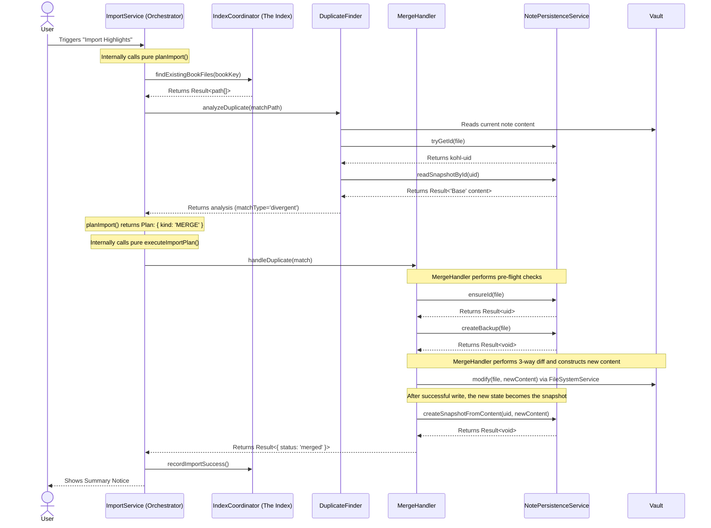

# KOReader Highlights Importer — Architecture (v1.4.2)

This document explains how the plugin is structured, why it is structured that way, and how to work within this architecture safely.

- [1. Mission & Guiding Principles](#1-mission--guiding-principles)
- [2. Architectural Paradigm: Stateful Shell, Functional Core](#2-architectural-paradigm-stateful-shell-functional-core)
- [3. Code Structure & Dependency Rules](#3-code-structure--dependency-rules)
- [4. Working in This Architecture](#4-working-in-this-architecture)
- [5. Error Handling: Result Types & AppFailure](#5-error-handling-result-types--appfailure)
- [6. Concurrency Strategy](#6-concurrency-strategy)
- [7. The Chain of Trust: Core Data Flow](#7-the-chain-of-trust-core-data-flow)
- [8. Deep Dives into Core Components](#8-deep-dives-into-core-components)
- [9. Cache Subsystem](#9-cache-subsystem)
- [10. Evolution: Stable Contracts vs Evolving Details](#10-evolution-stable-contracts-vs-evolving-details)

---

## 1. Mission & Guiding Principles

The primary mission of the KOReader Highlights Importer plugin is to provide a powerful and, above all, **safe** tool for synchronizing reading highlights into Obsidian.

Every architectural decision is weighed against these non‑negotiable principles:

1. **Data Integrity is Paramount**
   The plugin must **never** silently lose or corrupt user data. This drives:
   - The `kohl-uid` system
   - Atomic snapshotting
   - 3‑way merge logic
   - **Strict Schema Validation**: Using `Zod` to enforce data invariants at the boundaries of Core and Shell.
   When unsure, we surface a clear conflict instead of guessing.

2. **Graceful Degradation & Resilience**
   The plugin must function in restrictive environments (sandboxed vaults, read‑only file systems, unusual platforms). When I/O fails, we:
   - Handle the error explicitly
   - Inform the user
   - Keep the rest of the plugin functional
   This favors reactive error handling over complex proactive capability probing.

3. **Performance at Scale**
   Large libraries must remain fast and responsive. This justifies:
   - A dedicated SQLite index
   - Parallel processing
   - Centralized, careful caching.

4. **Clarity Over Cleverness**
   Maintainability is a first‑class goal.
   - Clear responsibilities
   - Explicit, boring logic
   - Minimal "magic"

5. **Champion Simplicity**
   We actively reduce complexity and line count.
   - Abstractions must justify themselves
   - Code that is easy to **delete** is valued

---

## 2. Architectural Paradigm: Stateful Shell, Functional Core

We use a strict **Stateful Shell, Functional Core** design. This separation is critical for testability, predictability, and safety.

### 2.1 Stateful Shell

The **Shell** is the outer layer. It owns all side effects and integration points.

**Responsibilities**

- Handling user commands and plugin lifecycle (`main.ts`, `CommandManager`)
- Rendering UI (modals, settings tab, status bar)
- All file I/O (`FileSystemService`, Obsidian `app.vault`)
- Accessing `app.metadataCache`
- Interacting with external devices (`DeviceService`)
- Logging, notices, and user‑visible failures
- Coordination/orchestration of pure logic

**Examples**

- `ImportService`
- `CommandManager`
- `FileSystemService`
- `MergeHandler`
- `NotePersistenceService`
- `IndexCoordinator`
- All components in `src/ui/`

### 2.2 Functional Core

The **Core** is the inner layer. It consists of **pure**, deterministic functions and data structures.

**Responsibilities**

- Parsing KOReader / Lua data
- Transforming annotations into Markdown
- Generating and merging frontmatter
- 3‑way diff/merge and conflict formatting
- Path normalization and slug generation
- Validation, formatting, general utilities

**Properties**

- No side effects
- No direct Obsidian APIs
- No direct file I/O, UI, or global state

**Examples**

- `src/lib/templateCore.ts`
- `src/lib/frontmatter.ts`
- `src/lib/merge/mergeCore.ts`
- `src/lib/pathing.ts`
- `src/lib/core/result.ts`
- `src/lib/errors/*`

A Core function may transform annotation data into Markdown, but **never** writes files or shows a `Notice`. The Shell calls it and performs side effects.

---

## 3. Code Structure & Dependency Rules

The repository layout encodes the architecture.

### 3.1 Directory Overview

- `main.ts`
  Plugin entrypoint. Initializes DI container, registers services, and wires Shell components.

- `core/`
  Infrastructure and cross‑cutting setup:
  - DI container (`DIContainer.ts`, `tokens.ts`, `registerServices.ts`)
  - Settings schema (`settingsSchema.ts`)
  - Plugin data persistence (`PluginDataStore.ts`)
  - UID rules (`uidRules.ts`)
  - Migrations (`MigrationManager.ts`)

- `services/` (**Stateful Shell**)
  Domain‑oriented services that orchestrate I/O, Core logic, and state.
  - `services/vault/` — Vault integration (e.g. `IndexCoordinator`, `NotePersistenceService`)
  - `services/import/` — Import orchestration (`ImportService`, planners/executors)
  - `services/device/` — KOReader device discovery and validation
  - `services/parsing/` — Hybrid services that combine `lib` logic with file access
  - `services/ui/` — Shell services focused on UI integration

- `lib/` (**Functional Core**)
  Framework‑agnostic, reusable logic, organized into semantic sub-packages.
  - `lib/parsing/` — Lua AST processing and metadata extraction
  - `lib/formatting/` — Date, highlight styling (Markdown escaping), and grouping logic
  - `lib/merge/` — 3-way merge implementation
  - `lib/core/` — Result types, object/string utilities
  - `lib/errors/` — Discriminated union of application failure types
  - `lib/concurrency/`, `lib/cache/`, `lib/database/` — Low-level primitives
  - `lib/obsidian/` — Narrow adapters for Obsidian types

- `ui/` (**Stateful Shell**)
  Obsidian-specific UI components:
  - Settings tab
  - Modals
  - Status bar manager
  - Suggestion components

- `tests/`
  Mirrors the structure above, plus doubles/mocks to enforce boundaries.

### 3.2 Allowed Dependencies (Layering Rules)

To keep the architecture enforceable and reviewable:

- `lib/*`
  - **May depend on:** other `lib/*` modules.
  - **Must not depend on:** `services/*`, `ui/*`, `core/`, or concrete Obsidian plugin objects.
- `core/*`
  - **May depend on:** `lib/*`.
  - **Provides:** DI and wiring; no plugin‑specific business logic.
- `services/*`
  - **May depend on:** `lib/*`, `core/*`, other `services/*` where it does not create cycles.
  - **Must not depend on:** `ui/*` components directly (UI integration goes through narrow abstractions).
- `ui/*`
  - **May depend on:** `services/*`, `lib/*`.
  - **Must not be depended on by:** `services/*` or `lib/*`.

If a change violates these rules, the design should be reconsidered. These boundaries are intentional.

---

## 4. Working in This Architecture

This section gives concrete guidance for contributors.

### 4.1 Adding New Behavior

When implementing a new feature:

1. **Put pure logic in `lib/`**
   - Parsing, transformations, decisions: implement as pure functions.
   - Use existing `Result` and `AppFailure` patterns if failures are predictable.

2. **Use `services/` for orchestration and side effects**
   - Wire `lib` functions, read/write files, call Obsidian APIs.
   - Show notices, handle logging, and coordinate UI.

3. **Return `Result<T, AppFailure>` for predictable failures**
   - Do not `throw` for missing files, invalid formats, etc.
   - Design explicit error cases; let the Shell respond.

4. **Handle errors at Shell boundaries**
   - Check `Result` using helpers (`isOk`, `isErr`).
   - Log via `LoggingService`.
   - Show user feedback via formatted messages.

5. **Respect the Chain of Trust**
   - Never bypass `NotePersistenceService` for UID/snapshot operations.
   - Never bypass `IndexCoordinator` for index reads/writes.

6. **Use the shared concurrency primitives**
   - Use `KeyedQueue` for per‑resource mutations.
   - Use `runPool` for scalable parallelism.
   - Avoid ad‑hoc concurrency patterns unless justified.

### 4.2 Changing Existing Behavior

Before changing behavior:

- Identify whether you are in Shell or Core.
- Preserve the separation: if pure logic is leaking Obsidian specifics, refactor.
- If a change impacts UIDs, snapshots, or the index, treat it as high risk, and:
  - Update relevant tests.
  - Validate `AppFailure` coverage.
  - Consider migration and backward compatibility.

---

## 5. Error Handling: Result Types & AppFailure

We distinguish **predictable failures** from **bugs** and treat them differently.

### 5.1 Predictable Failures

Examples:

- File not found
- Malformed or partial data
- Unavailable network drive
- Permission issues in known locations

These are **not** bugs. They are valid states that must be represented and handled.

### 5.2 Unexpected Exceptions (Bugs)

Examples:

- Programming errors (null dereference, impossible branch)
- Corrupt internal invariants
- Catastrophic environment issues where continuation is unsafe

These indicate defects and may legitimately `throw`.

### 5.3 The Result Type

Defined in `src/lib/core/result.ts`:

- `Result<T, E>` is either:
  - `Ok<T>` — success with value
  - `Err<E>` — failure with structured error

Usage rules:

1. Functions in **Core** and **Services** that can fail predictably **must** return `Result<T, AppFailure>`.
2. They **must not `throw`** for predictable conditions (missing file, invalid user input, etc.).
3. Utility helpers (`isOk`, `isErr`, `unwrapOr`, etc.) are preferred over ad‑hoc patterns.

### 5.4 AppFailure

Defined under `src/lib/errors/` as a discriminated union:

- Each failure has:
  - A `kind` string (e.g. `"NotFound"`, `"ParseError"`, `"DeviceUnavailable"`)
  - Context fields (e.g. `path`, `bookKey`, `reason`) for logging and debugging.

Guidelines:

- Add new `kind`s thoughtfully and document them.
- Avoid generic catch‑all errors with no context.
- Do not log in `lib/*`; the Shell is responsible for consuming `AppFailure`:
  - Logging via `LoggingService`
  - User messaging via `formatError`/notices

### 5.5 Throwing as a Last Resort

- `throw` is reserved for:
  - Invariants that should never break
  - Situations where recovery is not defined
- Any such `throw` should be rare, deliberate, and well‑documented.

---

## 6. Concurrency Strategy

The concurrency model is designed for **predictability**, **safety**, and **performance at scale**.

### 6.1 Serialization for Safety — KeyedQueue

Operations that mutate a single logical resource must be serialized:

- Note file content
- Snapshots for a specific `kohl-uid`
- Index entries for a given book/note

We use `KeyedQueue` to enforce:

- All tasks for the same key run sequentially.
- Prevents race conditions and corrupted writes.

**Rule:**
If you are mutating something identified by a path, UID, or similar key, route it through a keyed queue.

### 6.2 Parallelism for Performance — runPool

I/O‑bound work that can be safely parallelized uses `runPool`:

- Scanning vault files during index rebuild
- Evaluating duplicate candidates
- Other fan‑out tasks over large sets

`runPool` provides:

- Bounded concurrency
- Streaming results (`Result` objects)
- Shared, battle‑tested semantics

**Rule:**
Use `runPool` instead of ad‑hoc `Promise.all` with hand‑rolled limits.

### 6.3 Concurrency Invariants

- Do not bypass `KeyedQueue` when multiple paths can touch the same resource.
- Do not introduce new concurrency primitives without:
  - Clear justification
  - Documentation in this section (or a reference)

---

## 7. The Chain of Trust: Core Data Flow

The "Chain of Trust" ensures a durable link between:

**KOReader Book → Obsidian Note → UID → Snapshot History → Index**

High‑level flow for a merge with local edits:

1. KOReader data is parsed into structured annotations.
2. An existing note is resolved using:
   - `IndexCoordinator` queries
   - Duplicate analysis
3. `NotePersistenceService`:
   - Ensures a stable `kohl-uid` in frontmatter
   - Manages snapshots keyed by UID
4. `MergeHandler`:
   - Performs a 3‑way merge:
     - Base: last snapshot
     - Local: current note content
     - Remote: new highlights
5. `FileSystemService`:
   - Applies the merged content atomically
6. `NotePersistenceService`:
   - Writes a new snapshot of the merged result
7. `IndexCoordinator`:
   - Updates index to reflect the new state

If any step fails predictably, it returns `Result<_, AppFailure>`; the Shell logs and surfaces it without breaking the chain.

### 7.1 Detailed Sequence Diagram

(Existing diagram preserved for reference.)



---

## 8. Deep Dives into Core Components

### 8.1 NotePersistenceService & the UID–Snapshot Bond

**Problem**
Note file paths are volatile. Safe merging requires a stable identity and a known "base" version.

**Solution**
`NotePersistenceService` centralizes identity and history:

1. **Identity (`kohl-uid`)**
   - Stored in frontmatter.
   - Serves as ground truth, decoupled from path/filename.

2. **History (Snapshots)**
   - After each successful merge/import, full note content is stored under its `kohl-uid`.
   - This snapshot is the "Base" for the next 3‑way merge.

3. **Atomicity**
   - UID updates and snapshot file operations are performed atomically.
   - Example: on UID collision resolution, snapshot moves happen before frontmatter updates, so the Chain of Trust is never inconsistent.

**Key Files**

- `src/services/vault/NotePersistenceService.ts`
- `src/lib/snapshotCore.ts`
- `src/core/uidRules.ts`

### 8.2 IndexCoordinator & the Resilient Index

**Problem**

- Full‑vault scans are slow.
- We must efficiently detect changes and duplicates.

**Solution**

Persistent SQLite index (`index.db`) with two primary roles:

1. **IndexDatabase (State Machine)**
   - Manages physical DB file using `ConcurrentDatabase` (sqlite.js).
   - Uses `Zod` schemas (`src/services/vault/index/schema.ts`) to validate data before persistence.
   - Gracefully falls back to in‑memory DB if:
     - File is corrupt
     - File system is read‑only
   - Coordinates non‑blocking background rebuild via `ParallelIndexProcessor`.

2. **IndexCoordinator (Orchestrator)**
   - Public API for all index interactions.
   - Listens to vault events (renames, deletes) to keep index consistent.
   - Provides methods:
     - `findExistingBookFiles`
     - Status queries: `isReady`, `isRebuilding`, etc.
   - Delegates low‑level operations to `IndexDatabase`.

**Key Files**

- `src/services/vault/index/IndexCoordinator.ts`
- `src/services/vault/index/IndexDatabase.ts`
- `src/services/vault/ParallelIndexProcessor.ts`
- `src/services/SqlJsManager.ts`

### 8.3 ImportService: The Import Facade

**Problem**
Import involves parsing, I/O, indexing, merging, and user feedback. Inlining this is unmaintainable.

**Solution**

`ImportService` is a Shell‑level facade that separates planning from execution:

- **Planning & Execution (Core Logic)**
  - Implemented in `src/services/import/importPlanner.ts`.
  - Pure functions:
    - `planImport(...) -> ImportPlan`
    - `executeImportPlan(plan, ...) -> Result`
  - No direct vault mutations.

- **Orchestration (Shell)**
  - Implemented in `src/services/import/ImportService.ts`.
  - Responsibilities:
    - Construct dependencies
    - Run `planImport` / `executeImportPlan`
    - Coordinate parallel execution where safe
    - Handle progress UI and user interaction

### 8.4 DeviceService & Heuristic Discovery

**Problem**

- KOReader `statistics.sqlite3` location varies.
- Full disk scans are too slow and brittle.

**Solution**

`DeviceService` uses the **Strategy Pattern** plus caching.

- `DiscoveryStrategy`:
  - `find(basePath): Promise<string | null>`

Implementations:

1. **ExplicitPathStrategy**
   - Validates a user‑provided override path.
   - Always checked first.

2. **WalkUpHeuristicStrategy**
   - Starts from the configured KOReader Highlights folder.
   - Walks up a bounded number of parents.
   - Checks for known marker directories (e.g. `.adds`, `koreader`).
   - Probes known relative paths for `statistics.sqlite3`.

**Orchestration & Caching (simplified)**

```ts
async getStatsDbPath(): Promise<string | null> {
    if (this.cachedDbPath !== undefined) return this.cachedDbPath;

    const explicitPath = await this.explicitPathStrategy.find(this.settings.statsDbPathOverride);
    if (explicitPath) return this.cachedDbPath = explicitPath;

    const scanPath = await this.getActiveScanPath();
    const heuristicPath = await this.walkUpStrategy.find(scanPath);
    if (heuristicPath) return this.cachedDbPath = heuristicPath;

    return this.cachedDbPath = null; // cache failures to avoid repeated scans
}
```

---

## 9. Cache Subsystem

Centralized under `src/lib/cache/` and exposed through `index.ts`.

### 9.1 Components

- **CacheManager**
  - DI-managed.
  - Creates and tracks caches by name/namespace.
  - Provides clear/cleanup operations (including pattern matching).

- **SimpleCache**
  - `Map`-based generic cache.
  - Optional LRU eviction.
  - Used as the backing store.

- **memoizeAsync**
  - Wraps an async loader.
  - Deduplicates concurrent calls (prevents thundering herd).
  - Integrates with `CacheManager`/`SimpleCache`.

### 9.2 Usage Guidelines

- Create caches via `CacheManager` in services.
- Use namespaced keys (e.g. `"device.sdr.metaName"`).
- Invalidate via Shell components that already observe vault events:
  - e.g. `IndexCoordinator` clears relevant entries on file changes.
- Avoid ad‑hoc module‑global caches; route through the shared system.

---

## 10. Evolution: Stable Contracts vs Evolving Details

The architecture has evolved through real failures, performance constraints, and user reports. Some aspects are intentionally stable; others are expected to change.

### 10.1 Stable Contracts (Do Not Break Lightly)

- **Shell/Core separation**
  - No `obsidian` imports or direct I/O in `lib/*`.
- **Result/AppFailure**
  - Predictable failures modeled as `Result<T, AppFailure>`, not exceptions.
- **Chain of Trust**
  - `NotePersistenceService` is the authority for UID and snapshots.
  - `kohl-uid` is the canonical identity, not file paths.
- **Index Abstraction**
  - `IndexCoordinator` is the sole public facade for index operations.
- **Concurrency Primitives**
  - Use of `KeyedQueue` and `runPool` for safety and scalability.

Changes to these require strong justification, migration planning, and documentation updates.

### 10.2 Evolving Details (Reasonable to Refine)

- Index schema, query optimizations, and heuristics
- Device discovery strategies and markers
- Specific merge strategies and conflict formatting
- Caching policies and eviction strategies
- UI workflows and interaction patterns built on top of the stable core

When evolving these, keep to the guiding principles:
- Never compromise data integrity.
- Preserve predictable behavior and clear failure modes.
- Prefer simple, well‑documented solutions over cleverness.
